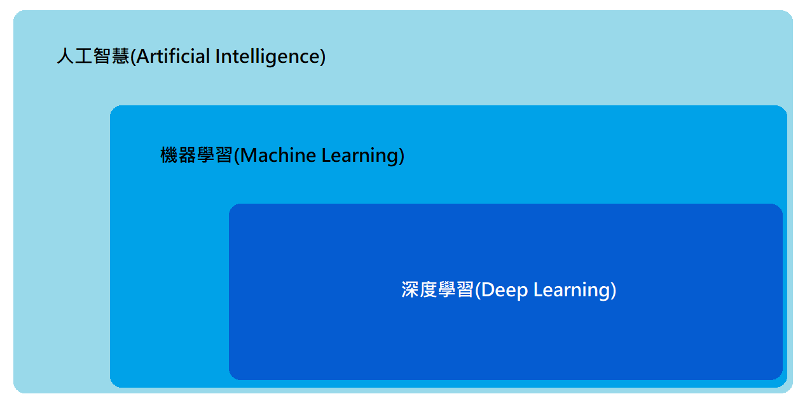

# python機器學習與深度學習

## Chapter1 Introduction

### 1.1 人工智慧、機器學習和深度學習的關係

#### 人工智慧:
指讓電腦具有人類的知識與行為。簡而言之，人工智慧主要在研究如何以電腦的程式技巧，執行一些需要人類智慧才能完成的工作。
#### 機器學習:
是人工智慧的一個分支，簡單來說機器學習就是透過特殊演算法，讓電腦能經由訓練從一大堆數據中找出規律性並產生模型，然後利用訓練出來的模型進行預測。
#### 深度學習:
是機器學習的一種方式，簡單來說深度學習就是透過各種神經網路，如多層感知器(MLP)、卷積神經網路(CNN)、循環神經網路(RNN)等，將一大堆數據輸入神經網路當中，讓電腦透過大量數據的訓練找出規律並自動學習，最後讓電腦能依據自動學習累積的經驗做出預測。

### 1.2 什麼是機器學習
機器學習上可分為訓練(Training)與預測(predict)。
機器學習的訓練資料由特徵(Features)和標籤(Label)組成。
將大量的數據資料經過特徵萃取後產生Features和Label，就可以透過機器學習產生模型，再用訓練完的模型對新的資料進行預測。

