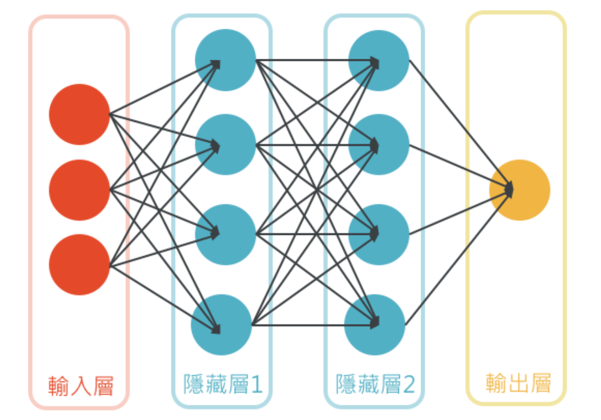

# Chapter1 Introduction
## 1.1 人工智慧、機器學習和深度學習的關係
  
### 人工智慧:
指讓電腦具有人類的知識與行為。簡而言之，人工智慧主要在研究如何以電腦的程式技巧，執行一些需要人類智慧才能完成的工作。
### 機器學習:
是人工智慧的一個分支，簡單來說機器學習就是透過特殊演算法，讓電腦能經由訓練從一大堆數據中找出規律性並產生模型，然後利用訓練出來的模型進行預測。
### 深度學習:
是機器學習的一種方式，簡單來說深度學習就是透過各種神經網路，如多層感知器(MLP)、卷積神經網路(CNN)、循環神經網路(RNN)等，將一大堆數據輸入神經網路當中，讓電腦透過大量數據的訓練找出規律並自動學習，最後讓電腦能依據自動學習累積的經驗做出預測。

## 1.2 什麼是機器學習
機器學習上可分為訓練(Training)與預測(predict)。
機器學習的訓練資料由特徵(Features)和標籤(Label)組成。
將大量的數據資料經過特徵萃取後產生Features和Label，就可以透過機器學習產生模型，再用訓練完的模型對新的資料進行預測。
  

## 1.3 什麼是深度學習
深度學習利用電腦模擬人類的神經網路，並將神經網路分成多個層，一般會有1個輸入層(Input Layer)、隱藏層(Hidden Layer)和1個輸出層(Output Layer)，因為隱藏層可以是1層，也可以是非常多層，因此稱為深度學習。  
  
圖片來源:
https://medium.com/marketingdatascience/%E5%BF%AB%E9%80%9F%E5%8F%8D%E6%87%89%E6%A9%9F%E5%88%B6-%E9%A1%9E%E7%A5%9E%E7%B6%93%E7%B6%B2%E8%B7%AF-a3bbdee4a6f6

神經網路並不一定是越多層效果就越好，有時候太多層反而會造成反效果。

## 1.4 Tensorflow與Keras
## 1.5 建置開發Tensorflow和Keras的虛擬環境
## 1.6 安裝GPU版的Tensorflow和Keras
