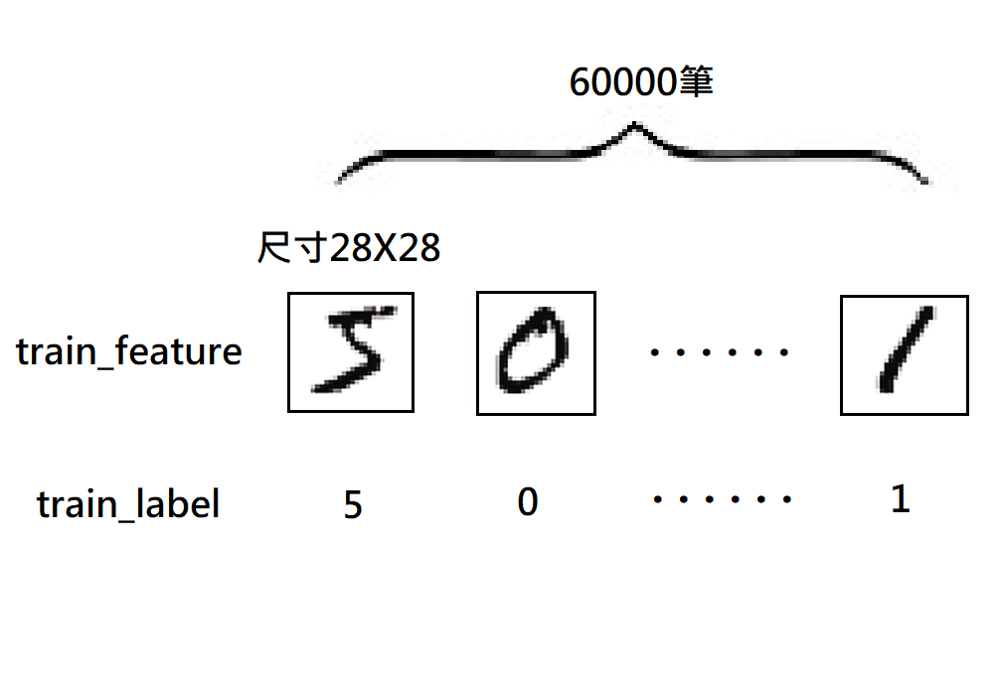

# Chapter2 多層感知器(MLP)

## 2.1 認識多層感知器(MLP)  
## 2.2 認識Mnist資料集
Mnist資料集收集整理了許多人0到9的手寫數字圖片所形成的資料集，其中包含了60000筆訓練資料，10000筆的測試資料。在Mnist資料集中，每一筆資料都是由images(數字圖片)和labels(真實數字)組成的黑白圖片資料。
  
圖片來源:https://docs.microsoft.com/zh-tw/archive/msdn-magazine/2014/june/test-run-working-with-the-mnist-image-recognition-data-set

### 下載&讀取Mnist資料集
#### 下載Mnist資料集
在python中可直接透過keras下載Mnist資料集，如下:
```python
from keras.datasets import mnist 
```
mnist.load_data()第一次執行時會將資料下載到使用者的目錄下的<.keras\datasets>檔名為mnist.npz。
#### 讀取Mnist資料集 
每次執行mnist.load_data()時，會先去檢查Mnist資料集是否已經存在，如果已經存在就不用重複執行下載。載入後資料分別放在(train_feature, train_label)訓練資料和(test_feature, test_label)測試資料的變數中，如下:
```python
(train_feature, train_label),(test_feature, test_label)=mnist.load_data() 
```

### 查看訓練資料
#### 顯示訓練資料內容
訓練資料是由每張都是28*28的單色數字圖片(images)和數字圖片為0~9的真實值(labels)各60000筆所組成。可使用len()函式查看資料長度(數量):
```python
print(len(train_feature),len(train_label))    # 60000 60000
```
可使用shape屬性查看其維度:
```python
print(train_feature.shape,train_label.shape)   # (60000, 28, 28) (60000,)
```
示意如下:  
  

## 2.3 多層感知器模型資料預處理
在進入訓練前，必須針對多層感知器的輸入輸出資料進行預處理，以增加模型效率。
### Feature資料預處理:
Feature就是模型中神經元輸入的資料，每個Mnist數字圖片都是一張28*28的二維向量圖片，必須轉為784個float數字的一維向量，並將float數字標準化來當作神經元的輸入，因此這裡會有784個輸入。
#### image轉換
以reshape()函式將28*28的數字圖片轉為784個數字的一維向量，再以astype將每個數字都轉為float數字，如下:
```python
train_feature_vector=train_fearure.reshape(len(train_fearure),784).astype('float32')
test_feature_vector=test_fearure.reshape(len(test_fearure),784).astype('float32')
```
可以透過shape屬性查看數字圖片已經轉成784個數字的一維向量，如下:
```python
print(train_feature_vector.shape,test_feature_vector.shape)   # (60000, 784) (10000,784)
```
當print(train_feature_vector[0])來顯示第一筆image資料內容時，可以看到資料是以0~255的浮點數(float)呈現，這些就是圖中每個點的灰階值。
#### image標準化
透過將0 ~ 255的數字除以255以得到0 ~ 1之間的浮點數，稱為標準化(Normalize)，標準化後可以提高模型預測的精確度以增加訓練效率，如下:
```python
train_feature_normalize=train_feature_vector/255
test_feature_normalize=test_feature_vector/255
```
這時再以print(train_feature_normalize[0])來顯示第一筆image經過正規化的資料內容時，可以看到資料是以0~1的浮點數呈現。
### Label資料預處理:
在很多機器學習任務中，feature或label並不總是連續值，有可能是分類值，例如:  
```
性別：["male"，"female"]  
地區：["Europe"，"US"，"Asia"]  
瀏覽器：["Firefox"，"Chrome"，"Safari"，"Internet Explorer"]  
```
因此，通常我們需要對其進行特徵數字化，例如：  
[“male”, “from US”, “uses Internet Explorer”]，表示為[0, 1, 3]  
[“female”, “from Asia”, “uses Chrome”]，表示為[1, 2, 1]  
但是，轉化為數字表示後，上述資料不能直接用在我們的分類器中。因為，分類器往往預設資料資料是連續的，並且是有序的。  
為了解決上路情況One-Hot Encoding是一個方法，我們可以用One-Hot Encoding的方式對上述的樣本[“male”, “from US”, “uses Internet Explorer”]編碼，“male”對應著[1，0]，“US”對應著[0，1，0]，“Internet Explorer”對應著[0,0,0,1]。則完整的特徵數字化的結果為：[1,0,0,1,0,0,0,0,1]，如下圖:  
    
label原本是用0~9的數字，為了增加模型的效率，神經元也經常採用One-Hot Encoding編碼的方式。  
使用np_utils.to_categorical可以將數字轉為One-Hot Encoding編碼，例如:  	
label=0，One-Hot Encoding=1000000000  
label=1，One-Hot Encoding=0100000000  
label=2，One-Hot Encoding=0010000000  
......  
label=9，One-Hot Encoding=0000000001    
先以from keras.utils import np_utils匯入模組，再以np_utils.to_categorical轉換，如下:  
```python
train_label_onehot=np_utils.to_categorical(train_label)
test_label_onehot=np_utils.to_categorical(test_label)
```

