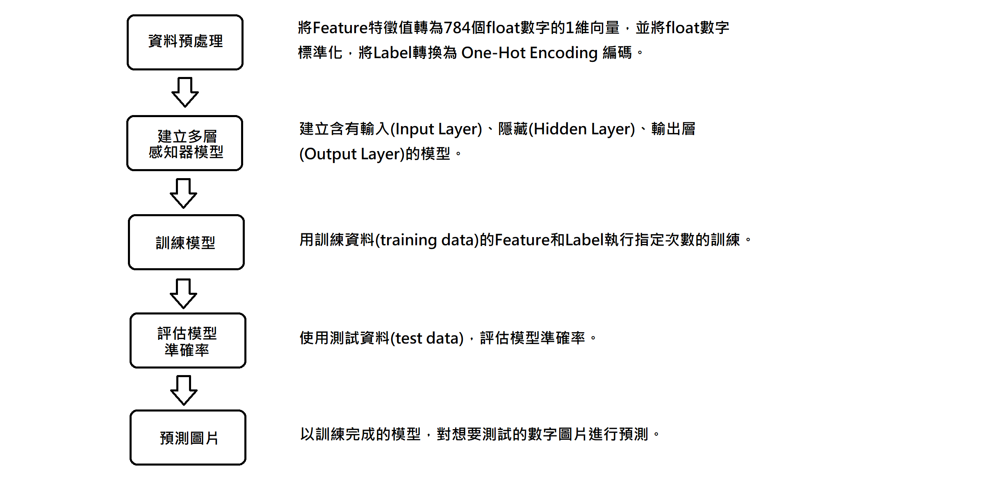

# Chapter2 多層感知器(MLP)

## 2.1 認識多層感知器(MLP)  
## 2.2 認識Mnist資料集
Mnist資料集收集整理了許多人0到9的手寫數字圖片所形成的資料集，其中包含了60000筆訓練資料，10000筆的測試資料。在Mnist資料集中，每一筆資料都是由images(數字圖片)和labels(真實數字)組成的黑白圖片資料。
  
圖片來源:https://docs.microsoft.com/zh-tw/archive/msdn-magazine/2014/june/test-run-working-with-the-mnist-image-recognition-data-set

### 下載&讀取Mnist資料集
#### 下載Mnist資料集
在python中可直接透過keras下載Mnist資料集，如下:
```python
from keras.datasets import mnist 
```
mnist.load_data()第一次執行時會將資料下載到使用者的目錄下的<.keras\datasets>檔名為mnist.npz。
#### 讀取Mnist資料集 
每次執行mnist.load_data()時，會先去檢查Mnist資料集是否已經存在，如果已經存在就不用重複執行下載。載入後資料分別放在(train_feature, train_label)訓練資料和(test_feature, test_label)測試資料的變數中，如下:
```python
(train_feature, train_label),(test_feature, test_label)=mnist.load_data() 
```

### 查看訓練資料
#### 顯示訓練資料內容
訓練資料是由每張都是28*28的單色數字圖片(images)和數字圖片為0~9的真實值(labels)各60000筆所組成。可使用len()函式查看資料長度(數量):
```python
print(len(train_feature),len(train_label))    # 60000 60000
```
可使用shape屬性查看其維度:
```python
print(train_feature.shape,train_label.shape)   # (60000, 28, 28) (60000,)
```
示意如下:  
  

## 2.3 多層感知器模型資料預處理
在進入訓練前，必須針對多層感知器的輸入輸出資料進行預處理，以增加模型效率。
### Feature資料預處理:
Feature就是模型中神經元輸入的資料，每個Mnist數字圖片都是一張28*28的二維向量圖片，必須轉為784個float數字的一維向量，並將float數字標準化來當作神經元的輸入，因此這裡會有784個輸入。
#### image轉換
以reshape()函式將28*28的數字圖片轉為784個數字的一維向量，再以astype將每個數字都轉為float數字，如下:
```python
train_feature_vector=train_fearure.reshape(len(train_fearure),784).astype('float32')
test_feature_vector=test_fearure.reshape(len(test_fearure),784).astype('float32')
```
可以透過shape屬性查看數字圖片已經轉成784個數字的一維向量，如下:
```python
print(train_feature_vector.shape,test_feature_vector.shape)   # (60000, 784) (10000,784)
```
當print(train_feature_vector[0])來顯示第一筆image資料內容時，可以看到資料是以0~255的浮點數(float)呈現，這些就是圖中每個點的灰階值。
#### image標準化
透過將0 ~ 255的數字除以255以得到0 ~ 1之間的浮點數，稱為標準化(Normalize)，標準化後可以提高模型預測的精確度以增加訓練效率，如下:
```python
train_feature_normalize=train_feature_vector/255
test_feature_normalize=test_feature_vector/255
```
這時再以print(train_feature_normalize[0])來顯示第一筆image經過正規化的資料內容時，可以看到資料是以0~1的浮點數呈現。
### Label資料預處理:
在很多機器學習任務中，feature或label並不總是連續值，有可能是分類值，例如:  
```
性別：["male"，"female"]  
地區：["Europe"，"US"，"Asia"]  
瀏覽器：["Firefox"，"Chrome"，"Safari"，"Internet Explorer"]  
```
因此，通常我們需要對其進行特徵數字化，例如：  
[“male”, “from US”, “uses Internet Explorer”]，表示為[0, 1, 3]  
[“female”, “from Asia”, “uses Chrome”]，表示為[1, 2, 1]  
但是，轉化為數字表示後，上述資料不能直接用在我們的分類器中。因為，分類器往往預設資料資料是連續的，並且是有序的。  
為了解決上路情況One-Hot Encoding是一個方法，我們可以用One-Hot Encoding的方式對上述的樣本[“male”, “from US”, “uses Internet Explorer”]編碼，“male”對應著[1，0]，“US”對應著[0，1，0]，“Internet Explorer”對應著[0,0,0,1]。則完整的特徵數字化的結果為：[1,0,0,1,0,0,0,0,1]，如下圖:  
    
label原本是用0~9的數字，為了增加模型的效率，神經元也經常採用One-Hot Encoding編碼的方式。  
使用np_utils.to_categorical可以將數字轉為One-Hot Encoding編碼，例如:  	
label=0，One-Hot Encoding=1000000000  
label=1，One-Hot Encoding=0100000000  
label=2，One-Hot Encoding=0010000000  
......  
label=9，One-Hot Encoding=0000000001    
先以from keras.utils import np_utils匯入模組，再以np_utils.to_categorical轉換，如下:  
```python
train_label_onehot=np_utils.to_categorical(train_label)
test_label_onehot=np_utils.to_categorical(test_label)
```

## 2.4 Mnist手寫數字辨識實作

### 手寫數字辨識實作流程:
  

### 資料預處理:
#### 載入資料
```python
from keras.datasets import mnist 
(train_feature, train_label),(test_feature, test_label)=mnist.load_data()
```

#### Feature特徵值轉換
```python
train_feature_vector=train_fearure.reshape(len(train_fearure),784).astype('float32')
test_feature_vector=test_fearure.reshape(len(test_fearure),784).astype('float32')
```

#### Feature特徵值標準化
```python
train_feature_normalize=train_feature_vector/255
test_feature_normalize=test_feature_vector/255
```

#### Label轉換為One-Hot Encoding編碼
```python
train_label_onehot=np_utils.to_categorical(train_label)
test_label_onehot=np_utils.to_categorical(test_label)
```

### 建立多層感知器模型:

#### 建立Sequential模型
```python
from keras.models import Sequential
model=Sequential()
```

#### 建立輸入層和隱藏層
```python
from keras.layers import Dense
model.add(Dense(units=256,input_dim=784,kernel_initializer=’normal’,activation=’relu’))
```
以add方法可以增加輸入層和隱藏層，Dense為上下緊密連結的神經網路層。
units表示隱藏層神經元數目有256個，input_dim=784表示輸入層神經元數目有784個，kernel_initializer=’normal'表示以常態分佈亂數來初始化參數weight和bias，activation=’relu表示使用relu這個激勵函數。

#### 建立輸出層
```python
model.add(Dense(units=10,kernel_initializer=’normal’,activation=’softmax’))
```
units表示輸出層神經元數目有10個，kernel_initializer=’normal'表示以常態分佈亂數來初始化參數weight和bias，activation=’relu表示使用relu這個激勵函數。

### 訓練模型:
#### 設定模型的訓練方式
```python
model.compile(loss='categorical_crossentropy', optimizer='adam', metrics=['accuracy'])
```
以Compile方法定義Loss損失函式，Optimizer最佳化方法，metrics評估準確率方法。

#### 進行訓練
```python
model.fit(x=train_feature_normalize, y=train_label_onehot, validation_split=0.2, epochs=10, batch_size=200, verbose=2)
```
x、y為設定訓練Feature和Label。
validation_split為設定驗證資料百分比，例如0.2表示將訓練資料保留20%當作驗證資料。
epochs為訓練次數，省略時只訓練1次。
batch_size為每批次讀取多少資料。
verbose設定是否顯示訓練過程，0不顯示、1詳細顯示、2簡易顯示。

loss:使用訓練資料得到的損失函數誤差值(值越小表示準確率越高)。
acc:使用訓練資料得到的評估準確率(值在0~1，越大代表準確率越高)。
val_loss:使用驗證資料得到的損失函數誤差值(值越小表示準確率越高)。
val_acc:使用驗證資料得到的評估準確率(值在0~1，越大代表準確率越高)。

### 評估準確率:
```python
scores=model.evaluate(test_feature_normalize,test_label_onehot)
print(‘\n 準確率’,scores[1])
```
evaluate可以評估模型的損失函數誤差值和準確率，會回傳串列，scores[0]是損失函數誤差值，scores[1]是準確率。

### 進行預測:
```python
prediction=model.predict_classes(test_feature_normalize)
show_images_labels_predictions(test_feature,test_label,prediction,0)
```

## 2.5 模型儲存和載入
在資料訓練完成後產生的模型可以儲存起來，以後就不用再花費時間重新訓練，只需載入儲存好的模型就好了。

### 模型儲存:
Keras使用HDF5檔案系統來儲存模型，使用.h5為副檔名，語法如下:
model.save(檔名)
舉例:將模型存為<Mnist_mlp_model.h5>
```python
model.save('Mnist_mlp_model.h5')
```

### 載入模型 :
匯入from keras.models import load_model，語法如下:
load_model(檔名)
舉例:載入模型檔<Mnist_mlp_model.h5>
```python
load_model('Mnist_mlp_model.h5')
```

## 2.6 模型權重的儲存與載入
當要載入的資料量非常大的時候，模型的訓練方式可以採用累積的方式來縮短每次訓練的時間，意思就是雖然每次訓練的資料量小，但是會記住之前訓練的結果，只要增加訓練次數的話一樣可以達到好的效果。

### 模型權重儲存:
這種模型累積的方式必須使用模型權重來達成，權重是模型的參數(但布包括模型)，語法如下:
model.save_weights(檔名)
舉例:將模型存為<Mnist_mlp_model_2.weight>
```python
model.save_weights("Mnist_mlp_model_2.weight")
```

### 載入模型權重:
只要載入已儲存的模型權重，就會取回先前的模型參數，這樣模型就會繼續上次的訓練以達到累積的效果，語法如下:
model.load_weights(檔名)
舉例:載入模型權重檔<Mnist_mlp_model_2.weight>
```python
model.load_weights("Mnist_mlp_model_2.weight")
```

## 2.7 建立多個隱藏層&過渡擬合(overfitting)

### 建立含有多個隱藏層的多層感知器:
在多層感知器的模型中，為了增加模型準確度，可以加入多層的隱藏層，但是隱藏層的數量越多並不代表可以有越好的準確度，因此我們可以透過在隱藏層中適度的加入dropout來避免overfitting的現象，雖然這樣會花費較多的時間，但準確度可以有明顯的提高。

### 過渡擬合(overfitting):
Overfitting就是過度學習訓練資料，變得無法順利去預測或分辨不是在訓練資料內的其他資料。以下例子:黑色線是我們訓練後期望得到的曲線，綠色線則是發生了overfitting時所得到的曲線，黃點是新加入要進行分類的data。
    
圖片來源:wiki

有個方法可以偵測是否有Overfitting的情況發生，就是將所有的Training data坼成二部分，一個是Training Set跟Validate Set，Training Set就是真的把資料拿去訓練的，而Validate Set就是去驗證此Model在訓練資料外的資料是否可行。

### 造成Overfitting的原因與解決方式:

#### 訓練的資料太少
想辦法收集更多的資料，或是自行生成更多的有效資料。

#### 擁有太多的參數，功能太強的模型
##### 減少參數或特徵或者是減少神經層數(就是降低模型的大小，複雜的模型容易造成過度學習)

##### 在相同參數跟相同資料量的情況下，可以使用Regularization(正規化) 
###### Weight decay(權重衰減)
Weight decay就是對擁有較大權重的參數，課以罰金，藉此控制Overfitting的情況，因為Overfitting就是Weight 太大的時候可能會發生的問題

##### 在相同參數跟相同資料量的情況下，可以使用Dropout
在訓練的時候，隨機放棄掉一些神經元和神經聯結 ，使這個神經網絡變得”不完整”，然後用一個不完整的神經網絡訓練一次。到第二次再隨機忽略另一些, 變成另一個不完整的神經網絡。利用這個隨機drop掉的規則, 每一次預測結果都不會依賴於其中某部分特定的神經元。Dropout的方法就是一邊"隨機”消除神經元，一邊訓練的方法。語法如下:  
model.add(Dropout(放棄百分比))  
舉例:放棄50%  
```python
model.add(Dropout(0.5))
```


