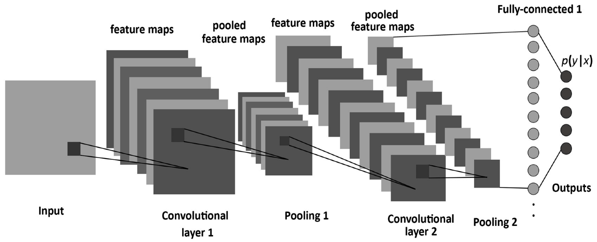
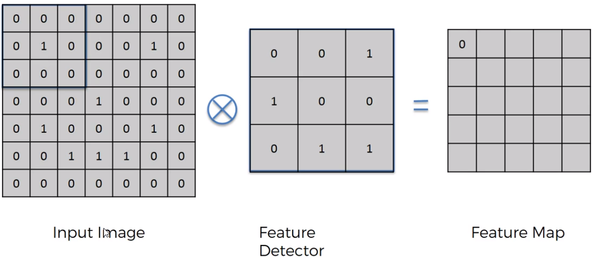
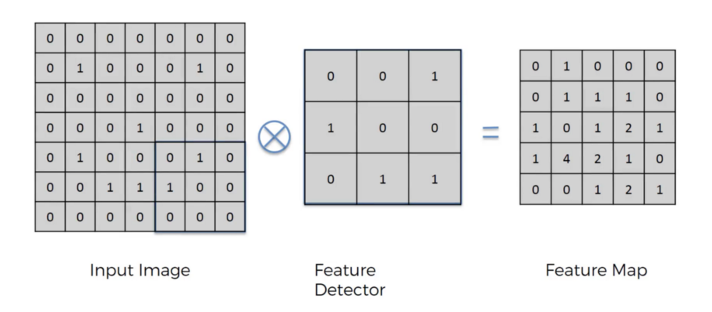
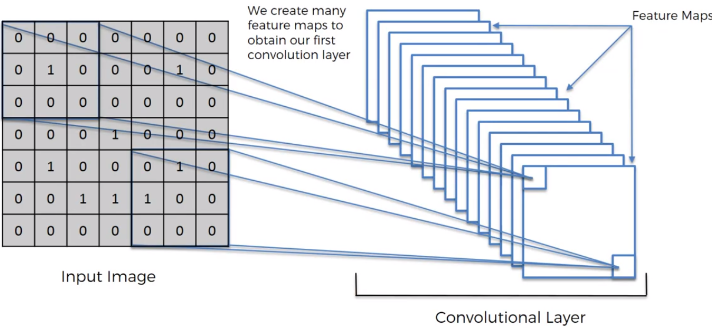
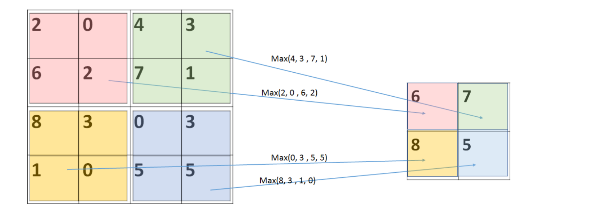
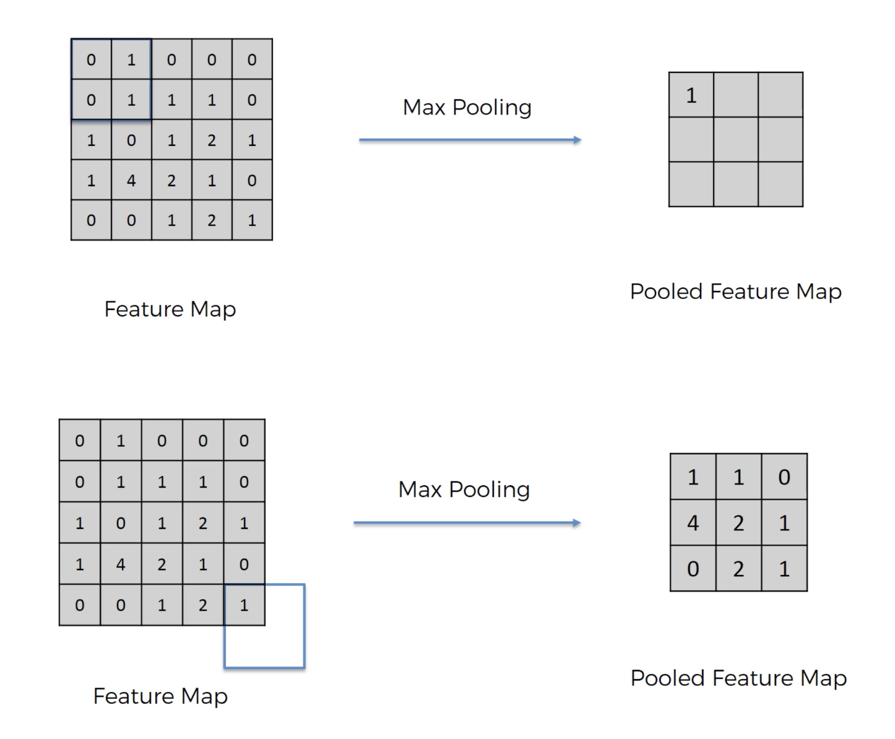

# Chapter3 卷積神經網路(CNN)
 
卷積神經網路(Convolutional Neural Networks)，它是目前深度神經網路（deep neural network）領域的發展主力，在圖片辨別上甚至可以做到比人類還精準的程度。  

傳統的DNN（即Deep neural network，泛指一般的深度學習網路）最大問題在於它會忽略資料的形狀。例如，輸入影像的資料時，該data通常包含了水平、垂直、color channel等三維資訊，但傳統DNN的輸入處理必須是平面的、也就是須一維的資料。舉例來說當DNN分類MNIST手寫數字集，其影像資訊是水平28 pixels、垂直28 pixels、color channel=1，即(1, 28, 28)的形狀，但輸入DNN時，所有dataset必須轉為一維，欄位數為784的dataset。  

因此，若去除了這些形狀資訊，就代表失去了一些重要的空間資料，像不同影像但類似的空間可能有著相似的像素值，RGB不同的channel之間也可能具有某些關連性、而遠近不同的像素彼此也應具有不同的關聯性，而這些資訊只有在三維形狀中才能保留下來。

 
## 3.1 卷積神經網路的基本結構
Deep learning中的CNN比多層感知器(MLP)多了卷積層（Convolutional layer）及池化層（Pooling layer）兩層，用以維持形狀資訊並且避免參數大幅增加。架構如下，多了2個卷積和池化層，最後透過平坦層(Flatten Layer)將特徵輸入到全連接層(Fully Connected)，也就是先前的多層感知器。

    
圖片來源:    
https://chtseng.wordpress.com/2017/09/12/%E5%88%9D%E6%8E%A2%E5%8D%B7%E7%A9%8D%E7%A5%9E%E7%B6%93%E7%B6%B2%E8%B7%AF/ 

### 卷積層(Convolutional layer): 

CNN的Convolution layer的目的就是在保留圖像的空間排列並取得局部圖像作為輸入特徵。

卷積運算就是將原始圖片的與特定的濾鏡(Feature Detector/Filter)做卷積運算變成Feature Map，卷積運算就是將下圖兩個3x3的矩陣作相乘後再相加，以下圖為例:

  
圖片來源:  
https://medium.com/jameslearningnote/%E8%B3%87%E6%96%99%E5%88%86%E6%9E%90-%E6%A9%9F%E5%99%A8%E5%AD%B8%E7%BF%92-%E7%AC%AC5-1%E8%AC%9B-%E5%8D%B7%E7%A9%8D%E7%A5%9E%E7%B6%93%E7%B6%B2%E7%B5%A1%E4%BB%8B%E7%B4%B9-convolutional-neural-network-4f8249d65d4f


0 x 0 + 0 x 0 + 0 x 1 + 0 x 1 + 1 x 0 + 0 x 0 + 0 x 0 + 0 x 1 + 0 x 1 = 0 依序做完整張表。

  
圖片來源:  
https://medium.com/jameslearningnote/%E8%B3%87%E6%96%99%E5%88%86%E6%9E%90-%E6%A9%9F%E5%99%A8%E5%AD%B8%E7%BF%92-%E7%AC%AC5-1%E8%AC%9B-%E5%8D%B7%E7%A9%8D%E7%A5%9E%E7%B6%93%E7%B6%B2%E7%B5%A1%E4%BB%8B%E7%B4%B9-convolutional-neural-network-4f8249d65d4f
  
  
  
中間的Feature Detector(Filter)會隨機產生好幾種，Feature Detector的目的就是幫助我們萃取出圖片當中的一些特徵(ex:形狀)，就像人的大腦在判斷這個圖片是什麼東西也是根據形狀來推測。

  
圖片來源:  
https://medium.com/jameslearningnote/%E8%B3%87%E6%96%99%E5%88%86%E6%9E%90-%E6%A9%9F%E5%99%A8%E5%AD%B8%E7%BF%92-%E7%AC%AC5-1%E8%AC%9B-%E5%8D%B7%E7%A9%8D%E7%A5%9E%E7%B6%93%E7%B6%B2%E7%B5%A1%E4%BB%8B%E7%B4%B9-convolutional-neural-network-4f8249d65d4f  


然而如果我們輸入的是三層的RGB圖像而非單層的灰階呢？或是想要使用多個Feature Detector(filter)來取得不同的特徵，那麼就需要在同一卷積層中定義多個Feature Detector(filter)，此時Feature Detector(filter)的數量就代表其Feature Detector(filter)的維度。當Feature Detector(filter)維度愈大，代表使用的Feature Detector(filter)種類愈多提取的圖像特徵也就越多，圖像識別的能力也就更好。

可以利用model.add(Conv2D())語法加入卷積層，例如:加入10個Filter，Filter大小為3X3，原始圖片大小28X28的卷積層。

```python
model.add(Conv2D(filters=10,kernel_size=(3,3),padding='same',input_shape=(28,28,1),activation='relu'))
```

filters:設定filter的個數，每個filter會產生不同的濾鏡效果。  
kernel_size:設定filter的大小，通常為5X5或3X3。  
padding:設定卷積運算圖片的大小，padding='same'會做zero-padding，讓Feature Map不會受到filter而影響大小，padding = ‘VALID’ ，Feature Map會根據filter大小和stride大小而變小。  
input_shape:設定原始圖片的大小。  
activation:設定激勵函數，relu會將小於0的資訊設定為0。  

### 池化層(Pooling Layer):

它的功能很單純，就是將輸入的圖片尺寸縮小（大部份為縮小一半）以減少每張feature map維度並保留重要的特徵，其好處有：   
1. 減少後續layer需要參數，加快系統運作的效率。 
2. 具有抗干擾的作用：圖像中某些像素在鄰近區域有微小偏移或差異時，對Pooling layer的輸出影響不大，結果仍是不變的。 
3. 減少過度擬合over-fitting的情況。 與卷積層相同，池化層會使用Feature Detector(filter)來取出各區域的值並運算，池化層用來縮小圖像尺寸的作法主要有三種：最大化（Max-Pooling）、平均化（Mean-Pooling）、隨機（Stochastic-Pooling）…等，以Max-pooling為例，作法如下：  

    
圖片來源:    
https://chtseng.wordpress.com/2017/09/12/%E5%88%9D%E6%8E%A2%E5%8D%B7%E7%A9%8D%E7%A5%9E%E7%B6%93%E7%B6%B2%E8%B7%AF/  


上圖範例剛好為偶數，若輸入圖像尺寸為奇數像素，則可採用周圍補零或捨棄邊的方式來處理，如下:

   
圖片來源:   
https://medium.com/jameslearningnote/%E8%B3%87%E6%96%99%E5%88%86%E6%9E%90-%E6%A9%9F%E5%99%A8%E5%AD%B8%E7%BF%92-%E7%AC%AC5-1%E8%AC%9B-%E5%8D%B7%E7%A9%8D%E7%A5%9E%E7%B6%93%E7%B6%B2%E7%B5%A1%E4%BB%8B%E7%B4%B9-convolutional-neural-network-4f8249d65d4f


可以利用model.add(MaxPooling2D())語法加入池化層，例如:加入可將卷積運算圖片大小縮減一半的池化層(長寬各縮減一半)。
```python
model.add(MaxPooling2D(pool_size=(2,2)))
```
pool_size:設定縮減的比率。

### 全連接層(Full connected layer):

Full connected layer指的就是一般的神經網路，基本上全連接層的部分就是將之前的結果平坦化之後接到最基本的神經網絡了。  

可以看出池化層減少了圖素的參數數量，卻保留了所有重要的特徵資訊，對於CNN的運作效率增進不少。

## 3.2 CNN實作Mnist手寫數字辨識
```python
import numpy as np
from keras.utils import np_utils 
np.random.seed(10)
from keras.datasets import mnist
import matplotlib.pyplot as plt
from keras.models import Sequential
from keras.layers import Conv2D,MaxPooling2D,Dropout,Flatten,Dense

def show_images_labels_predictions(images,labels,predictions,start_id,num=10):
	plt.gcf().set_size_inches(12,14)  #set_size_inches 建立圖形後在 Matplotlib 中更改圖形大小
	if num>25:
num=25
for i in range(0,num):
ax=plt.subplot(5,5,1+i) 
ax.imshow(np.reshape(images[start_id], cmap='binary') #顯示黑白圖片
			if len(prediction)>0:   #有AI預測結果資料才在標題顯示預測結果
				title='ai='+str(predictions[i])
				title+=(' (o)' if predictions[i]==labels[i] else ' (x)')
title+='\nlabel='+str(labels[i])
else:  #沒有AI預測結果資料只在標題顯示真實數值

	title='label='+str(labels[i])
ax.set_title(title,fontsize=12)   #x,y軸不顯示刻度
ax.set_xticks([]) 
ax.set_yticks([]) 
start_id=start_id+1 
plt.show

(train_feature, train_label),(test_feature, test_label)=mnist.load_data()

train_feature_vector=train_fearure.reshape(len(train_fearure),784).astype('float32')
test_feature_vector=test_fearure.reshape(len(test_fearure),784).astype('float32')

train_feature_normalize=train_feature_vector/255
test_feature_normalize=test_feature_vector/255

train_label_onehot=np_utils.to_categorical(train_label)
test_label_onehot=np_utils.to_categorical(test_label)

model=Sequential()

model.add(Conv2D(filters=10,kernel_size=(3,3),padding='same',input_shape=(28,28,1),activation='relu'))

model.add(MaxPooling2D(pool_size=(2,2)))  #(10,14,14)

model.add(Conv2D(filters=20,kernel_size=(3,3),padding='same',activation='relu'))

model.add(MaxPooling2D(pool_size=(2,2)))  #(20,7,7)

model.add(Dropout(0.2))

model.add(Flatten())

model.add(Dense(units=256,activation=’relu’))

model.add(Dense(units=10,activation=’softmax’))

model.compile(loss='categorical_crossentropy', optimizer='adam', metrics=['accuracy'])
model.fit(x=train_feature_normalize, y=train_label_onehot, validation_split=0.2, epochs=10, batch_size=200, verbose=2)

scores=model.evaluate(test_feature_normalize,test_label_onehot)
print(‘\n 準確率’,scores[1])

prediction=model.predict_classes(test_feature_normalize)

show_images_labels_predictions(test_feature,test_label,prediction,0)
```


